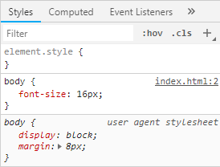

# CSS 与 渲染

CSS 是怎么样决定元素的样式，最终渲染出来的呢？


1. CSS 文本生成 CSSOM 树。
2. CSSOM 树与 DOM 树合并生成渲染树（Render Tree）。
3. 布局（Layout）计算每个对象的位置和大小。
4. 绘制（Paint）最终像素到屏幕上。


## 渲染

### CSSOM

CSS 对象模型（CSS Object Model），它是一颗树装结构。

如果有下面一段 CSS 文本

```css
body { font-size: 16px }
p { font-weight: bold }
span { color: red }
p span { display: none }
img { float: right }
```

那么它生成的 CSSOM 树大致如下：


但它还不是最终的 CSSOM 树。因为浏览器会提供一套默认样式（User Agent 样式），我们只是覆盖了默认的样式。



### 生成成渲染树（Render Tree）


构建渲染树的过程大致如下：

1. 从 DOM 树根节点开始遍历
   1. 如果节点为不可见节点，如 `<meta>`，`<script>`，`<template> `等，则跳过。
   2. 如果节点被 CSS 隐藏（display：none），则跳过。
   3. 计算节点的部分样式。

### 布局（Layout）

计算渲染树中对象的位置和大小。当重新执行这个阶段时，它也被称为**重排**（Relayout）或者**回流**（Reflow）。

### 绘制（Paint）

将渲染树上的节点转换成屏幕上的像素。这个阶段也为称为栅格化。当重新执行这个阶段时，它也被称为**重绘**（Repaint）。


## 参考资料

1. [构建对象模型](https://developers.google.com/web/fundamentals/performance/critical-rendering-path/constructing-the-object-model?hl=zh-cn)
2. [渲染树构建、布局及绘制](https://developers.google.com/web/fundamentals/performance/critical-rendering-path/render-tree-construction?hl=zh-cn)
3. [阻塞渲染的 CSS](https://developers.google.com/web/fundamentals/performance/critical-rendering-path/render-blocking-css?hl=zh-cn)